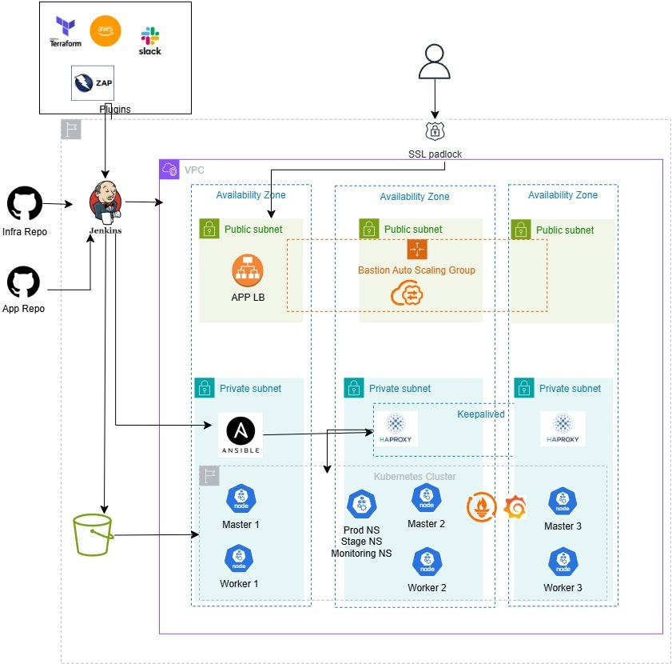

# Highly Available Kubernetes on AWS, Built with Terraform, Ansible and Jenkins

A production-style, **self-managed Kubernetes cluster (kubeadm)** on AWS, provisioned end to end with **Infrastructure as Code** and delivered through a **CI/CD pipeline**. One `terraform apply` takes you from an empty AWS account to a 3-master / 3-worker cluster running a microservices app in separate **stage** and **prod** environments, with **Prometheus and Grafana** monitoring, all behind HTTPS load balancers with real DNS names.

No managed Kubernetes service is used (no EKS). Every layer is built and automated by hand: networking, load balancing, the control plane, the CNI, the app and the monitoring stack.



## What it demonstrates

| Area | What is built |
|---|---|
| **Infrastructure as Code** | Modular Terraform: VPC, subnets, NAT, security groups, EC2, IAM, ALBs, ACM, Route 53 |
| **High availability** | 3 control-plane nodes behind 2 HAProxy servers with a Keepalived virtual IP, spread across 3 availability zones |
| **Kubernetes from scratch** | `kubeadm` v1.34, containerd + cri-dockerd, Weave CNI, stacked etcd, joined by Ansible |
| **Configuration management** | Ansible playbooks (uploaded to S3, pulled by the Ansible server at boot) bootstrap and deploy everything with no manual steps |
| **CI/CD** | Jenkins pipeline: Checkov IaC security scan, `fmt`, `validate`, `plan`, `apply` or `destroy`, Slack notifications |
| **Security** | Private subnets for the cluster, no public SSH (bastion reached through SSM Session Manager), least-open security groups, encrypted/versioned remote state in S3 |
| **Environments** | `stage` and `prod` namespaces of the Sock Shop microservices app, each with its own HTTPS URL |
| **Observability** | `kube-prometheus-stack` (Prometheus, Alertmanager, Grafana) exposed on its own domain |
| **DNS and TLS** | Wildcard ACM certificate (DNS-validated) and Route 53 records for every service |

## Architecture

```
GitHub (infra + app repos) ──► Jenkins ──► Terraform ──► AWS
                                                          │
 Users ─► Route 53 ─► ALB (HTTPS, ACM cert) ─► worker NodePorts ─► Kubernetes
                                                          │
 Bastion (SSM) ─► Ansible server ─► SSH ─► masters / workers / HAProxy
```

- **Networking:** one VPC with 3 public and 3 private subnets across 3 AZs and a NAT gateway. The cluster nodes live in the private subnets.
- **Control plane:** 3 masters. The Kubernetes API is reached through the HAProxy pair and a Keepalived VIP (`10.0.1.19`), so either HAProxy server can fail.
- **Workers:** 3 nodes running the app and monitoring workloads.
- **Ingress:** four ALBs (`stage.`, `prod.`, `prometheus.`, `grafana.<your-domain>`) terminate TLS and forward straight to the NodePorts on the workers (IP-type target groups).
- **Bootstrap:** the Ansible server runs the playbooks in order: dependencies, Keepalived, `kubeadm init`, member masters, workers, kubectl and CNI, stage, prod, monitoring.
- **Access:** nothing is open on port 22 to the internet. Use SSM Session Manager to reach the bastion, then SSH onward.

## Repository layout

```
.
├── main.tf, variable.tf, output.tf, provider.tf   # Root stack: the Kubernetes cluster
├── Jenkinsfile                                    # CI/CD pipeline
├── create-s3-bucket.sh / delete-s3-bucket.sh      # Remote state bootstrap and teardown
├── Jenkins/                                       # Stack 1: Jenkins server, ALB, ACM cert, DNS
└── module/
    ├── cluster-vpc/     # VPC, subnets, NAT, key pair
    ├── bastionhost/     # Bastion auto scaling group (SSM access)
    ├── ansible/         # Ansible server + playbooks uploaded to S3
    │   └── playbook/    # kubernetes_dependence, keepalived, init_control_plane,
    │                    # member_control_plane, join_worker_node, kubectl,
    │                    # stage, prod, monitoring_stack, haproxy_ingress
    ├── haproxy/         # HAProxy servers for the API server
    ├── master-node/     # Control plane EC2 instances
    ├── worker-nodes/    # Worker EC2 instances
    └── loadbalancer/    # ALBs, listeners, target groups, Route 53 records
```

## How to use this project

### Prerequisites

- An AWS account and the AWS CLI configured (`aws configure`)
- Terraform 1.10 or later
- A **domain you own with a public Route 53 hosted zone** (needed for the certificate and the DNS records)
- An S3 bucket name that is unique worldwide
- Optional: a Slack workspace and a Jenkins Slack credential for notifications

### 1. Change these values first

These settings are specific to the original author's account and must be replaced:

| What | File | Change to |
|---|---|---|
| State bucket name | [create-s3-bucket.sh](create-s3-bucket.sh), [provider.tf](provider.tf), [Jenkins/provider.tf](Jenkins/provider.tf), `bucket_name` in [variable.tf](variable.tf) | Your unique bucket name |
| Region | the same files, and the `availability_zone` lines in [module/cluster-vpc/main.tf](module/cluster-vpc/main.tf) | Your region and its AZs (default `eu-west-2`) |
| Domain | `domain` in [Jenkins/variable.tf](Jenkins/variable.tf) and `domain_name` in [main.tf](main.tf) | Your domain |
| Slack channel and credential | [Jenkinsfile](Jenkinsfile) (`SLACKCHANNEL`, `slack-cred`) | Your channel and Jenkins credential ID, or remove the Slack blocks |
| Application repo | `app_repo_url` in [stage.yml](module/ansible/playbook/stage.yml) and [prod.yml](module/ansible/playbook/prod.yml) | Your own manifests (a single `complete.yaml`) |
| Domain for the HAProxy ingress playbook | `domain` in [haproxy_ingress.yml](module/ansible/playbook/haproxy_ingress.yml) | Your domain, or drop the playbook if you do not use it |
| New Relic account ID | [module/haproxy/main.tf](module/haproxy/main.tf) and [haproxy-userdata.sh](module/haproxy/haproxy-userdata.sh) | Your values, or remove the New Relic install line |
| Instance types and counts | [variable.tf](variable.tf) | Whatever fits your budget |

### 2. Create the remote state and the Jenkins stack

```bash
chmod +x create-s3-bucket.sh
./create-s3-bucket.sh
```

This creates a versioned, encrypted, private S3 bucket and then applies the `Jenkins/` stack: the Jenkins server behind an HTTPS ALB at `jenkins.<your-domain>`, together with the wildcard certificate the cluster uses.

> The script also creates a DynamoDB lock table. On Terraform 1.10+ you can use S3-native locking instead: replace `dynamodb_table = "..."` with `use_lockfile = true` in both backend blocks.

### 3. Create the pipeline in Jenkins

1. Sign in at `https://jenkins.<your-domain>` and install the Slack, Pipeline and JUnit plugins.
2. Create a Pipeline job that points at this repository and uses the `Jenkinsfile`.
3. Run it with `action = apply`.

The pipeline runs Checkov, `terraform init`, `fmt -check`, `validate`, `plan` and then `apply`. It posts the result to Slack.

Prefer no Jenkins? Run it from your machine:

```bash
terraform init
terraform apply
```

### 4. Wait for the bootstrap

The Ansible server configures the whole cluster from its user data, which takes roughly 15 to 25 minutes. Follow it with:

```bash
aws ssm start-session --target <bastion-instance-id>
ssh ubuntu@<ansible-server-ip>
sudo tail -f /var/log/cloud-init-output.log
```

### 5. Use it

| URL | Service |
|---|---|
| `https://stage.<your-domain>` | Sock Shop, stage namespace |
| `https://prod.<your-domain>` | Sock Shop, prod namespace |
| `https://grafana.<your-domain>` | Grafana (default login `admin` / `prom-operator`, change it) |
| `https://prometheus.<your-domain>` | Prometheus |

Check the cluster from a HAProxy host, which has kubectl configured:

```bash
kubectl get nodes
kubectl get pods -A
```

Re-run a single stage by hand from the Ansible server, for example `ansible-playbook /etc/ansible/playbooks/stage.yml`.

### 6. Tear down

Destroy the cluster stack first (the Jenkins pipeline with `action = destroy`, or `terraform destroy`). Destroy the `Jenkins/` stack second, because the cluster reads its certificate. Then run `delete-s3-bucket.sh` if you want to remove the state bucket.

## Cost

This runs 10 or more EC2 instances, a NAT gateway and five ALBs (one for Jenkins, four for the cluster). It is not free-tier friendly, so check the AWS pricing calculator for your region and destroy the stack when you are not using it.

## Design decisions and known limitations

- **kubeadm instead of EKS.** The point is to show how the control plane, etcd, HA endpoint and CNI fit together.
- **Weave Net** is used as the CNI. It is no longer actively maintained, so Calico or Cilium would be the upgrade for a real deployment.
- **Single NAT gateway and a single Ansible server** keep the cost down. A production build would use one NAT per AZ.
- **Plain HTTP inside the VPC.** Public traffic is HTTPS to the ALB. ALB to node traffic stays on the private network over HTTP.
- **Default Grafana credentials** are in the playbook defaults. Replace them with a secret for anything beyond a demo.
- **Checkov findings** are reported by the pipeline without blocking the build. Tighten that for stricter environments.

## Ideas to extend it

- Move the Sock Shop deployment to Helm or Argo CD for GitOps
- Add an ingress controller and cert-manager instead of one ALB per service
- Add Cluster Autoscaler, or replace the fixed workers with an auto scaling group
- Back up etcd to S3 on a schedule
- Alert on Slack from Alertmanager

---

Built as a hands-on DevOps portfolio project. Feedback and pull requests are welcome.
